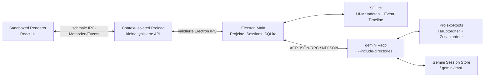

# Implementierungsplan: native Electron-UI für Gemini CLI

Stand: 20. August 2026

## 1. Kurzfassung

Das Projekt wird als native Electron-Desktop-Anwendung umgesetzt. Ein abgesicherter Renderer zeigt die React-Oberfläche; der Electron-Main-Prozess verwaltet Fenster, Projekte, Persistenz, ACP und die bereits installierte Gemini CLI. Es gibt keinen lokalen Webserver, keinen Cloud-Dienst und keinen direkten Zugriff auf die Gemini API.

Die wichtigste technische Entscheidung ist die Anbindung über den offiziellen ACP-Modus:

```text
gemini --acp
```

ACP ist für IDEs und andere grafische Clients vorgesehen. Es liefert strukturierte JSON-RPC-Nachrichten über `stdin`/`stdout` und unterstützt unter anderem Streaming, Bilder, Tool-Aufrufe, Freigaben, Abbruch sowie das Erstellen und Laden von Sessions. Die Terminaloberfläche wird deshalb nicht per PTY oder Screen-Scraping nachgebaut.

Empfohlener MVP-Stack:

- Desktop-Hülle: Electron
- Build und Distribution: Electron Forge mit fest gepinnter Vite-Konfiguration
- Renderer: React, TypeScript, Vite, native CSS/CSS-Variablen
- Main und Preload: Node.js und TypeScript
- Gemini-Anbindung: exakt gepinnte stabile ACP-v1-Version von `@agentclientprotocol/sdk` und `gemini --acp`; ACP v2 bleibt deaktiviert
- Kommunikation: schmale, typisierte Electron-IPC-API; ein fester Main→Renderer-Kanal für sequenzierte Event-Batches
- Persistenz: SQLite für App-Metadaten und die normalisierte UI-Timeline
- Paketverwaltung: npm
- Tests: Vitest, React Testing Library und Playwright für Electron; deterministischer Fake-ACP-Prozess

Die App unterstützt zunächst ausschließlich Gemini CLI. Eine kleine Provider-Schnittstelle verhindert trotzdem, dass Gemini-spezifische Protokolldetails in UI und Datenmodell verteilt werden.

## 2. Ausgangslage und Annahmen

Das Repository ist aktuell vollständig leer. Es gibt keine bestehenden Framework-, Build- oder Designvorgaben.

Für diesen Plan gelten folgende Annahmen:

1. Die Anwendung wird lokal von genau einer Person genutzt.
2. Gemini CLI ist bereits installiert und über die normale CLI-Anmeldung authentifiziert.
3. Das Ergebnis ist eine installierbare oder portable Electron-Desktop-App.
4. Ein App-Projekt besteht aus einem Hauptordner und null bis fünf zusätzlichen Ordnern, die an beliebigen Stellen im Dateisystem liegen dürfen.
5. Der Standardmodus für Tool-Aufrufe ist `default`; riskante Aktionen werden nicht automatisch bestätigt.
6. Zunächst werden Sessions vollständig unterstützt, die über diese UI erstellt oder einmal in die UI importiert wurden.
7. Die vorläufige Zielversion ist Gemini CLI `0.56.0` oder neuer. Entscheidend bleibt eine Laufzeitprüfung der tatsächlichen Fähigkeiten, nicht nur die Versionsnummer.

Die aktuelle Entwicklungsumgebung enthält Gemini CLI `0.56.0`, Node.js `25.2.1` und npm `11.6.2`. Die Version auf dem Arbeitsrechner muss noch bestätigt werden.

## 3. Ziele

### 3.1 MVP-Ziele

- App-Projekte anlegen, umbenennen, archivieren und löschen
- pro Projekt einen Hauptordner und mehrere zusätzliche, frei verteilte Ordner verwalten
- alle Projektordner in derselben Gemini-Session als gemeinsamen Multi-Root-Workspace verwenden
- Gemini in allen freigegebenen Projektordnern suchen, lesen und nach Bestätigung Änderungen vornehmen lassen
- pro Projekt mehrere Gemini-Sessions anlegen, öffnen, umbenennen und löschen
- mehrere Sessions unabhängig voneinander laufen lassen
- bestehende UI-Sessions nach App-Neustart fortsetzen
- Antworten live streamen
- Markdown, Codeblöcke und Links sicher darstellen
- Tool-Aufrufe mit Status, Argumenten, Ergebnis, Fehlern und gegebenenfalls Diff anzeigen
- Tool-Freigaben in der UI beantworten
- laufende Turns abbrechen
- Gemini-Modus anzeigen und wechseln, soweit ACP dies anbietet
- Modell anzeigen und wechseln, soweit die installierte Version dies anbietet
- Bilder per Drag-and-drop, Zwischenablage und Dateiauswahl anhängen
- Bildvorschau und Entfernen vor dem Senden
- Session-Suche, Pinning, Archivierung und lokale Anzeigenamen
- verständliche Diagnose für fehlende CLI, falsche Version, fehlende Anmeldung und Prozessabstürze
- Tastaturbedienung und grundlegende Barrierefreiheit

### 3.2 Nicht Teil des ersten MVP

- weitere Agenten wie Claude Code oder Codex
- Cloud-Synchronisierung oder Accounts für die UI
- eigener Gemini-API-Client oder eigene Tokenverwaltung
- vollständiger Terminalemulator
- vollständige IDE mit Dateibaum, Editor und Git-Client
- MCP-Konfigurationseditor
- Mobile App
- stilles Auto-Approve oder YOLO als Standard

## 4. Warum ACP und nicht die Terminal-UI

Gemini CLI dokumentiert ACP ausdrücklich als Programmierschnittstelle für IDEs und Developer Tools. Die Verbindung verwendet JSON-RPC 2.0 als zeilengetrenntes JSON über Standard-Ein- und -Ausgabe.

Der aktuelle ACP-Umfang umfasst unter anderem:

- `initialize`
- `authenticate`
- `session/new`
- `session/load`
- `session/prompt`
- `session/cancel`
- `session/set_mode`
- einen derzeit noch nicht vollständig stabilen Modellwechsel
- Text- und Thought-Streaming
- Tool-Aufrufe und Tool-Status
- Freigabeanfragen
- Bilder, Audio und eingebetteten Kontext als Prompt-Inhalte
- verfügbare Slash Commands
- optional einen clientseitigen Dateisystem-Proxy

Primärquellen:

- [Gemini CLI: ACP Mode](https://geminicli.com/docs/cli/acp-mode/)
- [ACP Dispatcher im offiziellen Repository](https://github.com/google-gemini/gemini-cli/blob/main/packages/cli/src/acp/acpRpcDispatcher.ts)
- [ACP Session Manager](https://github.com/google-gemini/gemini-cli/blob/main/packages/cli/src/acp/acpSessionManager.ts)
- [ACP Session-Verarbeitung](https://github.com/google-gemini/gemini-cli/blob/main/packages/cli/src/acp/acpSession.ts)
- [Agent Client Protocol: Prompt Turn](https://agentclientprotocol.com/protocol/v1/prompt-turn)
- [ACP: TypeScript SDK](https://agentclientprotocol.com/libraries/typescript)

Die interaktive Terminal-UI per PTY zu steuern wäre wesentlich fragiler: Farben, Cursorbewegungen, Bestätigungsdialoge und Layoutänderungen müssten interpretiert werden. PTY-Scraping wird daher nicht als Fallback eingeplant.

Der Headless-Modus mit `--output-format stream-json` bleibt nützlich für Diagnosen und spätere One-shot-Aktionen, aber nicht als vollwertiges Chat-Backend. In Headless-Ausführung können interaktive Freigaben nicht zuverlässig aus der UI beantwortet werden.

### 4.1 Multi-Root-Projekte in Gemini CLI

Gemini CLI unterstützt zusätzliche Workspace-Roots über wiederholte `--include-directories`-Argumente. Diese Ordner werden Teil desselben Workspace-Kontexts. Dateiwerkzeuge wie Suche, Lesen, Schreiben und Ersetzen können dadurch über alle Roots arbeiten; relative Pfade bleiben auf den Hauptordner bezogen, Discovery-Werkzeuge können Treffer aus allen Roots liefern.

Eine Session für ein Projekt mit drei Roots wird beispielsweise so gestartet:

```text
gemini --acp \
  --skip-trust \
  --include-directories /pfad/zum/frontend \
  --include-directories /anderer/pfad/zur/shared-lib
```

Der Hauptordner wird zusätzlich als `cwd` des Gemini-Prozesses und in `session/new` gesetzt. Die zusätzlichen Roots werden jeweils als eigenes Argument übergeben, nie als zusammengesetzter Shell-String. Die aktuelle CLI dokumentiert maximal fünf zusätzliche Verzeichnisse; dieses Limit wird beim Capability-Spike verifiziert und in der Projekt-UI verständlich angezeigt.

Die native Ordnerauswahl samt Bestätigung im Projektdialog ist dabei die explizite Trust-Entscheidung der Person. Der Prozess erhält deshalb zusätzlich `--skip-trust`: Ohne dieses Flag wartet Gemini in einem neu ausgewählten Ordner vor dem ACP-Handshake auf einen Terminaldialog, den ein ACP-Client nicht beantworten kann. Dies überspringt nur diesen vorgelagerten Ordnerdialog; Tool-Freigaben und der gewählte Approval-Modus bleiben aktiv.

Obwohl der allgemeine ACP-Standard zusätzliche Session-Verzeichnisse kennt, kündigt Geminis aktuelle ACP-Implementierung diese Capability nicht an und verarbeitet sie bei `session/new` nicht. Deshalb ist `--include-directories` bewusst die einzige Quelle für zusätzliche Roots. Ein Gemini-Prozess darf nie Sessions mit unterschiedlichen Root-Sets mischen.

Wichtig: „Kontext aus allen Ordnern“ bedeutet nicht, dass der gesamte Inhalt aller Roots ungefragt in jeden Prompt kopiert wird. Gemini kann über seine Tools in allen Roots suchen und die relevanten Dateien lesen. Das automatische Laden von `GEMINI.md` aus Zusatzroots bleibt im MVP bei Geminis Standardverhalten; ein eigener Schalter dafür kann später ergänzt werden.

Primärquellen:

- [Gemini CLI: `/directory` und Multi-Directory Support](https://geminicli.com/docs/reference/commands/)
- [Gemini CLI Configuration: `includeDirectories`](https://geminicli.com/docs/reference/configuration/)
- [Gemini CLI Trusted Folders](https://geminicli.com/docs/cli/trusted-folders/)

## 5. Produktform: native Electron-App

Electron ist eine feste Produktentscheidung, keine spätere Alternative. Die App wird als betriebssystemspezifisches, signierbares Desktop-Paket ausgeliefert.

Warum Electron hier sinnvoll ist:

- Der Main-Prozess kann die offizielle ACP-TypeScript-Bibliothek direkt verwenden.
- Drag-and-drop, Zwischenablage, native Dateidialoge und Fensterzustand sind plattformübergreifend verfügbar.
- Gemini CLI kann als lokaler Child Process ohne zusätzlichen Runtime-Installer gesteuert werden.
- Renderer, privilegierter Main-Prozess und Gemini-Child-Prozesse lassen sich klar isolieren.
- Electron Forge erzeugt Installer beziehungsweise portable Artefakte für die Zielplattform.

Der Preis sind eine vergleichsweise große Download- und RAM-Größe. Deshalb bleiben Abhängigkeiten, Fensteranzahl und gleichzeitig aktive Gemini-Prozesse bewusst begrenzt.

Es gibt keinen Node-Sidecar und keinen Hintergrund-Webdienst: Electron Main ist bereits der Node-Host der App. Die Electron-/Node-Runtime wird mit dem Desktop-Paket ausgeliefert; nur die externe Gemini-CLI-Installation samt ihrer eigenen Laufzeit und Anmeldung bleibt Voraussetzung.

Produktionsstart:

```text
GeminUI starten
  -> Single-Instance-Lock übernehmen
  -> SQLite im Electron-userData-Verzeichnis öffnen und migrieren
  -> Gemini Binary und Version prüfen
  -> sandboxed BrowserWindow mit lokaler, paketierter React-App öffnen
  -> letztes Projekt und letzte Session wiederherstellen
```

## 6. Zielarchitektur



### 6.1 Verantwortlichkeiten

Renderer:

- Layout, Navigation und Composer
- optimistische Anzeige der User-Nachricht
- Darstellung normalisierter Events
- Bildvorschau
- Freigabedialoge
- kein Node.js, kein direkter Dateisystemzugriff und kein rohes Electron-IPC

Preload:

- exakt eine schmale, typisierte `window.gemUi`-API über `contextBridge`
- eine Methode pro erlaubter Aktion
- Umwandlung nativer gedroppter `File`-Objekte über `webUtils.getPathForFile`
- keine Weitergabe von `ipcRenderer`, Eventobjekten oder beliebigen Kanalnamen

Electron Main:

- Fenster-, Menü-, Dialog- und App-Lebenszyklus
- Projekt- und Root-Verwaltung
- IPC-Schemavalidierung und Senderprüfung
- SQLite, Migrationen und Event-Timeline
- CLI-Erkennung und Kompatibilitätsprüfung
- offizieller ACP-TypeScript-Client
- Gemini-Prozess-Lebenszyklus
- Session- und Turn-Zustandsmaschine
- genau ein Gemini-Child-Process pro aktiver Session
- Normalisierung Gemini-spezifischer Events
- sichere Behandlung externer Links

Gemini CLI:

- Authentifizierung
- Modellkommunikation
- Gesprächskontext über alle Projekt-Roots
- Tool-Ausführung und Policy Engine
- native projektbezogene Session-Persistenz

## 7. Repository-Struktur

```text
/
├── src/
│   ├── main/
│   │   ├── app-lifecycle/
│   │   ├── adapters/
│   │   ├── gemini/
│   │   ├── ipc/
│   │   ├── processes/
│   │   ├── projects/
│   │   ├── sessions/
│   │   ├── storage/
│   │   ├── security/
│   │   └── index.ts
│   ├── preload/
│   │   ├── api.ts
│   │   └── index.ts
│   ├── renderer/
│   │   ├── app/
│   │   ├── components/
│   │   ├── features/
│   │   │   ├── attachments/
│   │   │   ├── chat/
│   │   │   ├── permissions/
│   │   │   ├── projects/
│   │   │   ├── sessions/
│   │   │   └── settings/
│   │   └── styles/
│   └── shared/
│       ├── contracts/
│       ├── events.ts
│       ├── models.ts
│       └── validation.ts
├── tests/
│   ├── fake-acp-agent/
│   ├── fixtures/
│   └── e2e/
├── forge.config.ts
├── vite.main.config.ts
├── vite.preload.config.ts
├── vite.renderer.config.ts
├── package.json
├── package-lock.json
├── tsconfig.json
└── implementation.md
```

Die Trennung verhindert, dass Renderer-Code direkten Zugriff auf Electron, SQLite, ACP oder Child Processes erhält.

## 8. Provider-Abstraktion

Es wird keine generische Multi-Agent-Plattform gebaut. Die Schnittstelle deckt nur die bereits benötigten Lebenszyklusoperationen ab:

```ts
interface AgentAdapter {
  probe(): Promise<AgentCapabilities>;
  createSession(input: CreateSessionInput): Promise<ProviderSession>;
  loadSession(input: LoadSessionInput): Promise<ProviderSession>;
  prompt(input: PromptInput): AsyncIterable<AgentEvent>;
  respondToPermission(input: PermissionResponse): Promise<void>;
  cancel(input: CancelInput): Promise<void>;
  setMode?(input: SetModeInput): Promise<void>;
  setModel?(input: SetModelInput): Promise<void>;
  disposeSession(input: DisposeSessionInput): Promise<void>;
}
```

`GeminiAcpAdapter` ist im MVP die einzige Implementierung. Die UI verarbeitet ausschließlich normalisierte `AgentEvent`-Typen und importiert keine ACP-Typen direkt.

`createSession` und `loadSession` erhalten im Main-Prozess immer ein validiertes `ProjectAccess` mit Hauptroot, Zusatzroots und aktueller Revision. Der Renderer kann weder dieses Objekt fälschen noch eigene Gemini-Flags setzen; Main konstruiert es unmittelbar aus SQLite und einer erneuten Pfadprüfung.

Vorgesehene normalisierte Events:

- `session.started`
- `session.ready`
- `message.user`
- `message.assistant.delta`
- `message.thought.delta`
- `tool.started`
- `tool.updated`
- `tool.completed`
- `tool.failed`
- `permission.requested`
- `permission.resolved`
- `usage.updated`
- `commands.updated`
- `turn.completed`
- `turn.cancelled`
- `turn.failed`
- `process.disconnected`

## 9. Projekt- und Prozessmodell

### 9.1 App-Projekte und Roots

Ein App-Projekt ist ein dauerhafter Container für Sessions und besteht aus:

```ts
type AppProject = {
  id: string;
  name: string;
  primaryRootId: string;
  rootRevision: number;
  archived: boolean;
  createdAt: string;
  updatedAt: string;
};

type ProjectRoot = {
  id: string;
  projectId: string;
  kind: "primary" | "additional";
  path: string;
  realPath: string;
  label: string;
  sortOrder: number;
};
```

Regeln:

- Genau ein Hauptordner ist erforderlich.
- Bis zu fünf zusätzliche Roots sind vorläufig erlaubt; das erkannte CLI-Limit ist maßgeblich.
- Alle Pfade werden beim Hinzufügen per `realpath` kanonisiert.
- Doppelte und redundant verschachtelte Roots werden erkannt und erklärt.
- Jeder Root wird im Projekteditor vollständig angezeigt und einzeln bestätigt.
- Alle Roots sind für Gemini grundsätzlich les- und schreibbare Workspace-Roots; konkrete Änderungen bleiben Geminis Policy- und Freigabefluss unterworfen.
- Der Hauptordner bestimmt `cwd` und Geminis projektbezogenen Session-Speicher.
- Ein Wechsel des Hauptordners ist für ein Projekt mit Sessions nicht still möglich; dafür ist eine explizite Migration oder ein neues Projekt nötig.
- Entfernen eines Roots oder Löschen eines App-Projekts löscht niemals die zugrunde liegenden Ordner oder Dateien.

Sessions speichern die zuletzt verwendete `rootRevision` und einen SHA-256-Fingerprint über die geordneten kanonischen Pfade als Auditdaten. Diese Daten sind **keine** Autorisierung für einen späteren Start. Beim Laden gilt immer der aktuelle Root-Satz des Projekts; ein zuvor entfernter Root darf niemals aus einer alten Session wieder freigeschaltet werden.

Änderungen an der Root-Liste sind nur möglich, wenn kein Turn des Projekts läuft. Danach beendet Main alle Gemini-Prozesse des Projekts, erhöht `rootRevision` und markiert betroffene Sessions als `roots_changed`. Beim nächsten Öffnen zeigt die UI die Differenz, empfiehlt wegen bereits im Modellverlauf enthaltener Informationen eine neue Session und verlangt vor dem Resume eine Bestätigung. Der Hauptroot ist unveränderlich, sobald eine Provider-Session für das Projekt existiert; ein anderer Hauptroot erzeugt ein neues Projekt.

### 9.2 Start und Erkennung

Beim ersten Start:

1. konfigurierten absoluten Gemini-Pfad prüfen
2. andernfalls `gemini` über den Prozess-PATH auflösen
3. `gemini --version` ausführen
4. `gemini --help` auf `--acp`, `--resume`, `--list-sessions`, `--delete-session` und `--approval-mode` prüfen
5. ACP-`initialize` ausführen und die tatsächlich angekündigten Fähigkeiten speichern
6. nur Features anzeigen, die die installierte Version wirklich unterstützt

Semver allein reicht nicht, weil Vorschauversionen und einzelne Regressionen vorkommen können.

Auf macOS und Linux wird ein absoluter ausführbarer Pfad gespeichert. Unter Windows zeigt eine npm-Installation häufig auf `gemini.cmd`; diese Datei kann nicht direkt mit dem gewünschten shell-freien Startmodell ausgeführt werden. Der Windows-Launchadapter muss deshalb den zugrunde liegenden Node-/Gemini-Einstiegspunkt sicher auflösen oder einen eng gekapselten `cmd.exe`-Aufruf mit vollständig getrennten, validierten Argumenten implementieren. Ein allgemeines `shell: true` ist ausgeschlossen und die gewählte Lösung ist ein Release-Gate für Windows.

### 9.3 Gemini Child Process im Main-Prozess

Der Electron-Main-Prozess besitzt den Process Manager und den ACP-Client. Alle I/O-Pfade sind asynchron; Token- und Tool-Updates werden in kurzen Batches verarbeitet, damit der Fenster-Lebenszyklus nicht blockiert. Ein Absturz eines Gemini-Child-Prozesses beendet nicht die Desktop-App und betrifft nur dessen Session.

Der Prozess wird immer ohne Shell gestartet:

```ts
const args = ["--acp", "--skip-trust"];

for (const root of project.additionalRoots) {
  args.push("--include-directories", root.realPath);
}

spawn(geminiBinary, args, {
  cwd: project.primaryRoot.realPath,
  env: childEnvironment,
  shell: false,
  stdio: ["pipe", "pipe", "pipe"],
});
```

Regeln:

- `stdout` enthält ausschließlich ACP und wird zeilenweise als NDJSON verarbeitet.
- `stderr` wird separat und größenbegrenzt für Diagnosen gehalten.
- Frei eingebbare zusätzliche CLI-Flags werden nicht zugelassen.
- Jeder zusätzliche Root ist ein separates Argument; es findet keine Shell-Interpolation statt.
- Der Main-Prozess übergibt dem Gemini-Adapter nur die bereits validierte Projektkonfiguration.
- Die vorhandene Gemini-Umgebung wird geerbt, aber niemals an Renderer oder Preload gesendet.
- GUI-Starts besitzen nicht immer denselben PATH wie ein Terminal; deshalb gibt es eine Binary-Auswahl in den Einstellungen.
- Die native Projektordner-Auswahl ist die sichtbare Trust-Bestätigung; `--skip-trust` verhindert anschließend ausschließlich den nicht über ACP beantwortbaren Terminaldialog.
- Trust und Sandbox werden für alle Projekt-Roots im Capability-Spike geprüft.
- Sandbox ist eine sichtbare, optionale Session-Einstellung. Zusätzliche Roots werden nur über Geminis Multi-Directory-Mechanismus und gegebenenfalls explizite Sandbox-Mounts freigegeben.
- Der ACP-Client kündigt im MVP weder `fs` noch `terminal` als Client-Capability an. Geminis nativer Multi-Root-`WorkspaceContext` bleibt damit der Arbeitskontext; der aktuell nur auf `cwd` ausgelegte ACP-Dateisystem-Proxy würde Zusatzroots sonst unvollständig abbilden. Die Root-Liste ist jedoch keine Betriebssystem-Sandbox: Shelltools können ohne aktivierte Gemini-Sandbox weiter reichen.

### 9.4 Ein Gemini-Prozess pro aktiver Session

Der MVP startet lazy einen ACP-Prozess pro geöffneter beziehungsweise laufender Chat-Session.

Gründe:

- klare Zuordnung von Prozess, Session und Freigabe
- ein Absturz betrifft nur eine Session
- Cancel und harte Prozessbeendigung bleiben lokal
- keine Gefahr, Events verschiedener Sessions falsch zuzuordnen

Zur Begrenzung des Ressourcenverbrauchs:

- nur aktive Sessions besitzen einen Prozess
- voreingestelltes Parallelitätslimit: 3 laufende Sessions
- weitere Prompts werden sichtbar eingereiht
- ein Idle-Reaper beendet lange inaktive Prozesse erst, nachdem Resume in der installierten CLI-Version erfolgreich verifiziert wurde
- beim erneuten Öffnen wird derselbe Gemini-Session-Identifier mit `session/load` geladen

Später kann auf einen ACP-Prozess pro App-Projekt umgestellt werden; die aktuelle Gemini-Implementierung kann mehrere Sessions in einem Prozess verwalten. Diese Optimierung ist nicht Teil des ersten MVP.

### 9.5 Abbruch und Crash Recovery

Abbruchfolge:

1. `session/cancel` senden
2. Status sofort auf `cancelling` setzen
3. ausstehende Freigabeanfragen als abgebrochen beantworten
4. auf den semantischen ACP-Abschluss `cancelled` warten
5. erst nach Timeout den Child Process beenden
6. unter Windows den gesamten Prozessbaum separat behandeln

Bei einem Crash:

- unvollständigen Turn als `failed` markieren
- begrenzten, redigierten `stderr`-Ausschnitt anbieten
- Session auf `disconnected` setzen
- Prozess beim nächsten Versuch neu starten
- `session/load` verwenden
- den letzten User-Prompt niemals automatisch erneut senden, weil Tool-Aufrufe bereits teilweise erfolgt sein könnten

Ein `render-process-gone` beendet laufende Gemini-Prozesse nicht automatisch; Main hält Events weiter vor und erlaubt einen sicheren Renderer-Neustart. Beim echten App-Ende werden alle ACP-Sessions geordnet geschlossen und anschließend verbleibende Prozessbäume mit Timeout beendet. `app.requestSingleInstanceLock()` verhindert im MVP zwei konkurrierende Besitzer derselben SQLite-Datenbank und Child-Prozesse.

## 10. Session-Modell

Gemini speichert Sessions automatisch projektbezogen unter `~/.gemini/tmp/<project_hash>/chats/`. Die UI verändert diese Dateien nicht direkt.

Die App trennt zwei IDs:

- `appSessionId`: interne stabile UUID für UI, Routing und SQLite
- `providerSessionId`: von Gemini gelieferte Session-UUID

Minimal gespeicherte Session-Daten:

```ts
type AppSession = {
  id: string;
  provider: "gemini-cli";
  providerSessionId: string | null;
  projectId: string;
  lastRootRevision: number;
  lastRootFingerprint: string;
  title: string;
  status: "idle" | "starting" | "running" | "awaiting_permission" |
    "cancelling" | "roots_changed" | "error" | "disconnected";
  model: string | null;
  mode: string | null;
  pinned: boolean;
  archived: boolean;
  createdAt: string;
  updatedAt: string;
};
```

### 10.1 Neue Session

1. Projekt und alle Root-Pfade aus SQLite laden und erneut per `realpath` validieren.
2. Lokalen Session-Datensatz anlegen.
3. aktuelle Root-Revision und deren Fingerprint als zuletzt verwendeten Auditstand speichern.
4. Gemini-Prozess mit dem Hauptordner als `cwd` und jedem Zusatzroot als `--include-directories` starten.
5. ACP initialisieren und `session/new` mit dem Hauptordner senden.
6. Gemini-UUID atomar im Session-Datensatz speichern.
7. unterstützte Modi, Modelle und Slash Commands übernehmen.

### 10.2 Session laden

1. lokalen Session-Datensatz und den **aktuellen** Root-Satz des Projekts laden
2. alle aktuellen Roots erneut kanonisieren und ihre Existenz prüfen
3. aktuellen Fingerprint mit `lastRootFingerprint` vergleichen
4. bei einer Abweichung die hinzugefügten und entfernten Roots anzeigen, eine neue Session empfehlen und die bewusste Fortsetzung bestätigen lassen
5. Prozess ausschließlich mit dem aktuellen Root-Satz starten und ACP initialisieren
6. `session/load` mit voller Gemini-UUID senden
7. von Gemini zurückgespielte Historie mit der lokalen Timeline deduplizieren
8. nach erfolgreichem Load `lastRootRevision` und `lastRootFingerprint` aktualisieren und neue Prompts freigeben

Ein entfernter Root wird dabei nie erneut übergeben. Die Warnung ist nötig, weil Informationen, die Gemini früher aus diesem Root gelesen hat, weiterhin im Gesprächsverlauf enthalten sein können; sie ist kein Mechanismus, um den alten Zugriff wiederherzustellen.

### 10.3 Session auflisten und löschen

ACP unterstützt aktuell das Erstellen und Laden, aber keine stabilen RPCs zum globalen Auflisten, Umbenennen oder Löschen aller Gemini-Sessions.

Deshalb gilt:

- Die Sidebar kommt primär aus der App-Datenbank.
- Umbenennen, Pinning und Archivierung sind reine UI-Metadaten.
- App-Metadaten und lokale Timeline können zuverlässig gelöscht werden.
- Das Löschen der nativen Gemini-Historie wird nur angeboten, wenn ein Contract-Test der Zielversion die eindeutige Zuordnung bestätigt. Falls die CLI nur einen flüchtigen Listenindex akzeptiert, wird unmittelbar vorher neu gelistet und eindeutig zur UUID zugeordnet; Indizes werden niemals dauerhaft gespeichert.
- Bestehende Terminal-Sessions können über einen gekapselten Importadapter für `gemini --list-sessions` gefunden werden.
- Da diese Ausgabe menschenlesbar und kein stabiles JSON-API ist, muss der Parser Fixture- und Versionstests besitzen.
- Interne Gemini-`.json`- oder `.jsonl`-Dateien werden nicht gelesen oder verändert.

Quelle: [Gemini CLI Session Management](https://geminicli.com/docs/cli/session-management/)

## 11. Persistenz

SQLite läuft ausschließlich im Main-Prozess unter einem eigenen Unterordner von Electron `app.getPath("userData")`, nicht in einem Projekt-Root. Für den MVP wird `better-sqlite3` mit WAL, vorbereiteten Statements und kurzen Transaktionen verwendet; Electron Forge muss das native Modul für die gebündelte Electron-Node-Version rebuilden und aus ASAR entpacken. Ein Wechsel auf das eingebaute `node:sqlite` erfolgt erst, wenn dessen Stabilität in der gepinnten Electron-Version ausreicht.

Vorgesehene Tabellen:

- `projects`
  - `id`, `name`, `primary_root_id`, `root_revision`, `archived`, Zeitstempel
- `project_roots`
  - `id`, `project_id`, `kind`, `path`, `real_path`, `label`, `sort_order`
- `sessions`
  - IDs und Metadaten aus dem Session-Modell sowie zuletzt verwendete Root-Revision und Fingerprint
- `session_roots`
  - geordnete historische Root-Stände nur für Audit, Vergleich und Warnungen; niemals Quelle der Startautorisierung
- `events`
  - `seq`, `session_id`, `turn_id`, `event_type`, `payload_json`, `created_at`
- `attachments`
  - `id`, `session_id`, `turn_id`, `mime_type`, `size`, `sha256`, `storage_path`, `created_at`
- `settings`
  - versionierte App-Einstellungen ohne Secrets
- `schema_migrations`

DB-Invarianten erzwingen genau einen Hauptroot pro Projekt und einen eindeutigen `real_path` je Projekt. Eine Root-Änderung, das Erhöhen der Revision und das Markieren betroffener Sessions erfolgen in einer Transaktion.

Die `events`-Tabelle ist append-only. Jede Session besitzt eine monoton steigende Sequenznummer. Nach Renderer-Reload oder Fensterneustart abonniert die UI mit ihrer letzten `seq`; Main verbindet SQLite-Replay und anschließende Live-Batches unter einem Session-Lock. Token-Deltas werden für UI und Datenbank in kurzen Intervallen gebündelt; es wird nicht für jedes Token eine synchrone Transaktion ausgeführt.

Gemini bleibt die Quelle des Modellkontexts. SQLite ist die zuverlässige Quelle für die UI-Timeline, lokale Titel, Entwürfe und Darstellungszustände. Beim Laden einer Session werden beide Seiten dedupliziert, nicht blind überschrieben.

## 12. Electron-IPC zwischen Renderer und Main

Der Renderer erhält ausschließlich eine explizite API aus dem Preload:

```ts
type GemUiDesktopApi = {
  getCapabilities(): Promise<AppCapabilities>;
  projects: {
    list(): Promise<AppProject[]>;
    pickFolders(): Promise<ProjectRootCandidate[]>;
    create(input: CreateProjectInput): Promise<AppProject>;
    rename(input: RenameProjectInput): Promise<AppProject>;
    setArchived(input: ArchiveProjectInput): Promise<AppProject>;
    setAdditionalRoots(input: SetProjectRootsInput): Promise<AppProject>;
    delete(input: DeleteProjectInput): Promise<void>;
  };
  sessions: {
    list(projectId: string): Promise<AppSession[]>;
    create(input: CreateSessionInput): Promise<AppSession>;
    update(input: UpdateSessionInput): Promise<AppSession>;
    delete(input: DeleteSessionInput): Promise<void>;
    sendPrompt(input: SendPromptInput): Promise<{ turnId: string }>;
    cancel(input: CancelTurnInput): Promise<void>;
    respondToPermission(input: PermissionResponse): Promise<void>;
  };
  attachments: {
    pickImages(input: PickImagesInput): Promise<Attachment[]>;
    stageDroppedFiles(files: File[]): Promise<Attachment[]>;
    stageClipboardImage(input: ClipboardImageInput): Promise<Attachment>;
    getPreviewBytes(input: AttachmentPreviewInput): Promise<Uint8Array>;
    remove(input: RemoveAttachmentInput): Promise<void>;
  };
  subscribeSessionEvents(
    input: { sessionId: string; afterSeq: number },
    callback: (events: StreamEnvelope[]) => void,
  ): Promise<() => void>;
  openExternalHttpsUrl(url: string): Promise<void>;
};
```

Live-Ereignisse enthalten mindestens:

```ts
type StreamEnvelope = {
  seq: number;
  sessionId: string;
  turnId: string | null;
  event: AgentEvent;
  timestamp: string;
};
```

Regeln:

- `ipcMain.handle` wird für Request/Response-Aktionen genutzt.
- Main → Renderer verwendet einen einzigen typisierten Eventkanal und bündelt Token-Deltas etwa alle 20 bis 50 Millisekunden.
- Bei `subscribeSessionEvents` registriert Main unter einem Session-Lock zuerst den Live-Abonnenten, bestimmt dann die Replay-Grenze und liefert geordnet alle fehlenden DB-Events. Der Renderer dedupliziert zusätzlich anhand von `seq`.
- Der Preload-Callback entfernt das Electron-Eventobjekt und liefert nur validierte Nutzdaten; Abmeldung entfernt den konkreten Listener.
- Main validiert Kanal, `senderFrame`, Sessionzuordnung und Payload mit gemeinsamen Laufzeitschemas.
- Die Preload-API wird eingefroren. Der Renderer erhält weder `ipcRenderer` noch generische `send`-/`invoke`-Methoden, Dateisystem, Shell, Umgebungsvariablen oder Prozessargumente.
- `stageDroppedFiles` löst echte Drop-Objekte ausschließlich im Preload über `webUtils.getPathForFile` auf; die aufgelösten Originalpfade werden nicht in React-State zurückgegeben.
- Mutierende Requests besitzen eine `clientRequestId`, damit Doppelklicks, Renderer-Retries und erneute IPC-Zustellung keinen Prompt doppelt auslösen.

Quellen:

- [Electron: Inter-Process Communication](https://www.electronjs.org/docs/latest/tutorial/ipc)
- [Electron: Context Isolation](https://www.electronjs.org/docs/latest/tutorial/context-isolation)

## 13. Prompt- und Eventfluss

1. UI sendet Text und Attachment-IDs.
2. Preload leitet ausschließlich den vorgesehenen Request weiter; Main validiert Sender, Payload, Projekt, aktuelle Root-Revision und `clientRequestId`.
3. User-Nachricht wird atomar als Event gespeichert.
4. Main startet den passenden ACP-Prozess oder verwendet ihn wieder.
5. Bilder werden im privilegierten Prozess aus dem App-Datenverzeichnis gelesen und in ACP Image Content Blocks umgewandelt.
6. `session/prompt` wird gesendet.
7. ACP-Updates werden im Main-Prozess normalisiert, gespeichert und sofort per typisiertem IPC an den Renderer gesendet.
8. Bei einer Freigabe wechselt die Session in `awaiting_permission`.
9. Die UI sendet exakt die ausgewählte, von ACP gelieferte `optionId` zurück.
10. Nach `end_turn`, `cancelled` oder Fehler wird der Turn finalisiert.

Pro Session ist genau ein Prompt gleichzeitig erlaubt. Andere Sessions dürfen parallel laufen.

## 14. Chat-Oberfläche

### 14.1 Layout

Linke Sidebar:

- Projekt-Umschalter
- „Projekt anlegen“ mit Name, Hauptordner und zusätzlichen Ordnern
- kompakte Root-Liste beziehungsweise Root-Badges im aktiven Projekt
- „Neue Session“
- Suche
- angepinnte, aktive und archivierte Sessions
- Statusindikator pro Session
- Kontextmenü für Umbenennen, Pinning, Archivieren und Löschen

Kopfzeile:

- Sessiontitel
- Projektname und Hauptordner
- aufklappbare Liste aller für diese Session freigegebenen Roots
- Warnung und Root-Diff, falls die aktuelle Projekt-Root-Revision vom zuletzt verwendeten Stand abweicht
- aktives Modell
- Freigabemodus
- Sandbox-/Trust-Status
- Prozessstatus

Chatbereich:

- User- und Assistant-Nachrichten
- inkrementelles Markdown-Streaming
- Codeblöcke mit Kopieraktion
- einklappbare Thought-Blöcke
- Tool-Karten
- Root-Badge an Datei- und Tool-Aktionen, damit sichtbar ist, welcher Ordner betroffen ist
- Diff-Darstellung bei Änderungen
- klare Fehler- und Abbruchzustände
- virtuelle Liste erst dann, wenn lange Verläufe dies messbar erfordern

Composer:

- automatisch wachsende Textarea
- `Enter` zum Senden, `Shift+Enter` für neue Zeile
- sichtbarer Stop-Button während eines Turns
- Drag-and-drop-Zone
- Einfügen aus der Zwischenablage
- Dateiauswahl
- Bildchips mit Vorschau, Name, Größe und Entfernen-Aktion
- Senden nur bei Text oder mindestens einem gültigen Anhang

### 14.2 Markdown-Sicherheit

- Raw HTML bleibt deaktiviert.
- Links erlauben nur sichere Protokolle.
- Tool-Ausgabe und ANSI-Sequenzen werden nie als HTML eingesetzt.
- Syntax-Highlighting wird lazy geladen.
- Externe Links werden im Main-Prozess validiert und nur für erlaubte `https:`-Ziele über `shell.openExternal` geöffnet.

## 15. Bilder und Anhänge

Der Bild-MVP unterstützt:

- PNG
- JPEG
- WebP
- GIF, sofern die installierte Gemini-Version die Capability bestätigt

SVG wird im MVP nicht als Bild akzeptiert, um aktive Inhalte und Sanitizing-Sonderfälle zu vermeiden.

Voreingestellte App-Limits, später konfigurierbar:

- maximal 4 Bilder pro Prompt
- maximal 10 MiB pro Bild
- maximal 25 MiB insgesamt pro Prompt

Attachment-Staging:

1. Die native Dateiauswahl läuft über `dialog.showOpenDialog` im Main-Prozess.
2. Bei Drag-and-drop löst der Preload den nativen Pfad mit `webUtils.getPathForFile` auf und sendet ihn direkt an den fest definierten Stage-Handler, ohne ihn an React zurückzugeben.
3. Bei Clipboard Paste übergibt der Renderer ein größenbegrenztes `Uint8Array` mit angekündigtem MIME-Type an eine eigene Binär-IPC.
4. Main prüft reguläre Datei beziehungsweise Bytes, Größenlimits, Magic Bytes und tatsächlichen MIME-Type.
5. Die Datei erhält einen zufälligen Namen im App-Datenverzeichnis; SHA-256, MIME-Type und Größe werden gespeichert.
6. Erst nach erfolgreicher Prüfung erhält der Renderer Attachment-ID, Anzeigename, MIME-Type und Größe.
7. Vorschaubilder werden als begrenzte Bytes über eine dedizierte Methode geliefert und im Renderer als widerrufbare Blob-URL angezeigt; es gibt keine freie `file://`-URL.
8. Beim Senden liest Main die freigegebene Attachment-Kopie und erzeugt einen ACP Image Content Block mit Base64-Daten.
9. Base64 wird weder in React-State noch in SQLite gespeichert; nicht gesendete temporäre Dateien werden automatisch bereinigt.

Der Renderer erhält keinen generischen Dateisystemzugriff. Gedroppte Originaldateien werden nur über den Importpfad gelesen; für die Session wird mit einer kontrollierten Kopie im App-Datenverzeichnis gearbeitet.

Quellen:

- [Electron `webUtils.getPathForFile`](https://www.electronjs.org/docs/latest/api/web-utils)
- [ACP: Content Types](https://agentclientprotocol.com/protocol/v1/content)

Text, PDF, Audio und Video werden erst nach dem Bild-MVP freigeschaltet. Das Datenmodell berücksichtigt sie bereits, die UI zeigt sie aber nur bei bestätigter Capability an.

## 16. Tool-Aufrufe und Freigaben

Jede Tool-Karte zeigt, soweit vorhanden:

- Anzeigename und Tool-Art
- exakten Befehl oder Aktion
- betroffene Pfade
- Argumente in lesbarer Form
- Diff
- laufenden Status
- Ergebnis oder Fehler
- getroffene Freigabeentscheidung

Freigaberegeln:

- Standard ist Geminis `default`-Modus.
- „Einmal erlauben“ und „Ablehnen“ sind die primären Aktionen.
- Die UI gibt exakt die von ACP empfangene `optionId` zurück.
- „Immer erlauben“ wird nur gezeigt, wenn Gemini diese Option liefert, und erhält eine zusätzliche Bestätigung.
- `auto_edit` kann der User bewusst pro Session wählen.
- YOLO ist standardmäßig verborgen oder mindestens hinter einer deutlichen Warnung und erneuten Bestätigung.
- Freigaben werden niemals nach einem Timeout automatisch erteilt.

Offene Kompatibilitätspunkte, die im Spike geprüft werden müssen:

- strukturierte `ask_user`-Fragen sind über ACP derzeit nicht in allen Fällen vollständig abbildbar
- Live-Zwischenstände lang laufender Shell-Befehle sind nicht zwingend mit einem echten Terminalstream identisch
- Sandbox-Erweiterungsanfragen müssen als eigener Fall getestet werden

Quellen:

- [Gemini CLI Policy Engine](https://geminicli.com/docs/reference/policy-engine/)
- [ACP: Tool Calls und Permission Requests](https://agentclientprotocol.com/protocol/v1/tool-calls)

## 17. Authentifizierung

Der MVP verwendet die vorhandene Gemini-CLI-Anmeldung.

- Die App kopiert keine OAuth-Tokens.
- API Keys werden nicht in SQLite, Renderer-State oder Web Storage gespeichert.
- Gemini läuft mit dem normalen User-Kontext, damit vorhandene Anmeldung und Sessions sichtbar bleiben.
- Bei `authRequired` zeigt die UI eine klare Diagnose und den empfohlenen Setup-Schritt.
- Optional kann später der von ACP angekündigte `authenticate`-Flow integriert werden.
- Falls ein Google-Login einen Browser öffnet, wird dies als explizite Aktion angekündigt.
- `GEMINI_CLI_HOME` wird nicht automatisch verändert.

Unternehmens-Proxys und vorhandene Gemini-Konfiguration werden an den Child Process vererbt, aber in Logs redigiert.

## 18. Sicherheitsmodell

### 18.1 Electron-Fenster und Renderer

Für das Hauptfenster gelten mindestens:

```ts
webPreferences: {
  nodeIntegration: false,
  contextIsolation: true,
  sandbox: true,
  webSecurity: true,
  preload: PRELOAD_PATH,
}
```

Zusätzlich:

- ausschließlich paketierte lokale UI laden; keine Remote-Webseite im Hauptfenster
- in Produktion ein privilegienarmes eigenes `app://`-Protokoll statt allgemeinem `file://` bevorzugen
- strikte Content Security Policy ohne Inline-Skripte und ohne `unsafe-eval`
- Navigation außerhalb der App blockieren
- `window.open` und neue Fenster standardmäßig ablehnen
- keine `<webview>`-Tags oder fremden Frames
- Chromium-Permission-Requests standardmäßig ablehnen
- externe HTTPS-Links nur nach Schema- und Zielprüfung im Main-Prozess öffnen
- DevTools und Dev-Server ausschließlich im Entwicklungsbuild
- aktuelle unterstützte Electron-Version verwenden und Security-Updates zeitnah übernehmen

### 18.2 IPC und nicht vertrauenswürdige Inhalte

- nur konkrete, dokumentierte IPC-Kanäle registrieren und im Preload einzeln wrappen
- jeden Request und jedes Event mit gemeinsamen Laufzeitschemas validieren
- `senderFrame` muss das erwartete Hauptfenster und das lokale `app://`-Dokument sein
- Nutzdaten-, Binärdaten- und Eventgrößen begrenzen
- interne Fehler und Stacktraces vor der Rückgabe an den Renderer redigieren
- Markdown, Tool-Ausgabe, Dateiinhalte und Agent-Nachrichten grundsätzlich als nicht vertrauenswürdig behandeln
- eine Renderer-XSS darf höchstens die eng begrenzten Aktionen von `window.gemUi` erreichen, niemals rohe IPC-, Shell- oder Dateisystemfunktionen

### 18.3 Dateisystem

- jeden Projekt-Root beim Hinzufügen mit `realpath` auflösen und explizit bestätigen
- Traversal und Symlink-Ausbrüche in allen app-eigenen Datei- und Attachment-Endpunkten testen und blockieren
- keine allgemeine Renderer-API zum Lesen beliebiger lokaler Dateien
- Hauptroot und jeder Zusatzroot werden separat gespeichert und in der UI sichtbar gemacht
- Gemini erhält bei jedem Start ausschließlich die aktuell autorisierten Projekt-Roots als `cwd` und `--include-directories`
- der ACP-Dateisystem-Proxy wird im MVP nicht angeboten; falls er später aktiviert wird, muss er jeden Zugriff gegen die aktuellen kanonischen Roots prüfen
- die Projekt-Root-Liste ist keine vollständige Tool- oder Prozess-Sandbox; eine harte Betriebssystemgrenze existiert nur, wenn Geminis Sandbox sie auf der Zielplattform nachweislich erzwingt

### 18.4 Prozess und Logs

- Prozesse nur mit Argumentarray und `shell: false`
- keine frei eingegebenen Kommandozeilenflags
- Gemini-Prozesse laufen im Main-Prozess, niemals in Preload oder Renderer
- stdout-Protokoll mit Zeilen- und Gesamtgrößenlimit
- stderr-Ringbuffer statt unbegrenzter Speicherung
- Produktionslogs enthalten standardmäßig keine Prompts, Modellantworten, Tool-Ausgaben oder Secrets
- Crashreports werden vor Anzeige redigiert

### 18.5 Gemini Trust und Sandbox

- Hauptroot (`cwd`) und alle zusätzlichen Roots sind jederzeit sichtbar
- Workspace Trust wird für keinen Root still umgangen
- Sandbox-Zustand wird sichtbar angezeigt
- Sandbox muss mit voneinander entfernten zusätzlichen Roots je Zielplattform getestet werden
- Auto-Approve bleibt eine bewusste User-Entscheidung

### 18.6 Paketierung

- Electron-, Forge-, Vite- und ACP-Versionen exakt pinnen und Lockfile einchecken
- Produktionscode als ASAR paketieren; native SQLite-Dateien gezielt entpacken
- nach erfolgreichem Packaging-Spike die Fuses `RunAsNode`, `EnableNodeOptionsEnvironmentVariable` und `EnableNodeCliInspectArguments` deaktivieren
- soweit von der Zielversion unterstützt, ASAR-Integrität aktivieren und ausschließlich Code aus dem ASAR laden
- Artefakte je Zielbetriebssystem nativ bauen und testen
- macOS-Pakete signieren und notarisieren; Windows-Installer für öffentliche Verteilung signieren
- keine unsignierten Auto-Updates im MVP

Quellen:

- [Gemini CLI Sandboxing](https://geminicli.com/docs/cli/sandbox/)
- [Gemini CLI Trusted Folders](https://geminicli.com/docs/cli/trusted-folders/)
- [Electron Security Checklist](https://www.electronjs.org/docs/latest/tutorial/security)
- [Electron Context Isolation](https://www.electronjs.org/docs/latest/tutorial/context-isolation)
- [Electron Process Sandboxing](https://www.electronjs.org/docs/latest/tutorial/sandbox)
- [Electron Fuses](https://www.electronjs.org/docs/latest/tutorial/fuses)
- [Electron: Application Distribution](https://www.electronjs.org/docs/latest/tutorial/application-distribution)
- [Electron Forge: Vite Plugin](https://js.electronforge.io/modules/_electron_forge_plugin_vite.html)

## 19. Bekannte Integrationsrisiken

### 19.1 ACP Session Resume

`session/load` ist offiziell implementiert, hatte in aktuellen Releases aber Regressionen beim Wiederherstellen und Zurückspielen der Historie. Deshalb ist ein echter Contract-Test mit der unterstützten Gemini-Version ein Release-Gate.

Relevanter offizieller Issue: [ACP session/load regression](https://github.com/google-gemini/gemini-cli/issues/28693)

Mitigation:

- Mindestversion nach dem Capability-Spike festlegen
- Resume mit zwei Turns und einem eindeutigen Merkwort testen
- bei fehlender Fähigkeit keine scheinbar erfolgreiche Fortsetzung anzeigen
- lokale Timeline weiter darstellen, aber einen neuen Prompt erst nach bestätigtem Gemini-Resume erlauben
- kein automatisches Replay alter Tool-Aufrufe

### 19.2 Session-Liste

Die App kann ihre eigenen Sessions zuverlässig verwalten. Der Import beliebiger bestehender CLI-Sessions hängt aktuell an menschenlesbarer `--list-sessions`-Ausgabe. Dieser Parser bleibt isoliert und versionsgetestet.

### 19.3 Instabiler Modellwechsel

Das entsprechende ACP-Verfahren ist derzeit nicht so stabil wie die Kernmethoden. Die UI behandelt Modellwechsel als Capability und bietet ihn nur an, wenn Handshake und Smoke-Test erfolgreich sind.

### 19.4 Headless-Fallback

`stream-json` liefert zwar strukturierte Events, aber keine gleichwertige interaktive Freigabeschleife. Es gibt deshalb im MVP keinen stillen Fallback von ACP auf Headless. Eine inkompatible Gemini-Version führt zu einer klaren Upgrade- oder Konfigurationsmeldung.

Quelle: [Gemini CLI Headless Mode](https://geminicli.com/docs/cli/headless/)

### 19.5 Multi-Root, Trust und Sandbox

`--include-directories` ist die offizielle Multi-Directory-Schnittstelle. Trotzdem müssen folgende Kombinationen mit der Zielversion und dem Zielbetriebssystem als Release-Gate getestet werden:

- Suche liefert Treffer aus Haupt- und Zusatzroot.
- Lesen, Erstellen und Ändern funktionieren in jedem schreibbaren Root.
- Native Dateiwerkzeuge behandeln einen Pfad außerhalb aller Roots erwartungsgemäß; Shelltools werden separat mit und ohne Sandbox geprüft.
- Symlink-Verhalten über Root-Grenzen ist dokumentiert; eine harte Blockade wird nur behauptet, wenn die aktive Sandbox sie im Test erzwingt.
- Trust-Regeln und projektlokale Gemini-Konfigurationen verhalten sich nachvollziehbar.
- Der gewählte Sandbox-Provider bindet alle freigegebenen Roots mit der gewünschten Read/Write-Stufe ein.
- Shell-Kommandos starten im Hauptroot; Zugriffe auf Zusatzroots verwenden sichtbare absolute Pfade.

Wenn eine Sandbox zusätzliche Roots nicht korrekt isolieren kann, darf die UI nicht behaupten, ein Root sei read-only. Sie zeigt die Einschränkung an und lässt die Session nur nach einer bewussten Entscheidung ohne diese Garantie starten.

### 19.6 Root-Änderungen bei bestehenden Sessions

Geminis Session-ID ist an den Hauptroot gebunden, während zusätzliche Roots beim Prozessstart konfiguriert werden. Eine Root-Änderung ist nur ohne laufenden Turn zulässig, erhöht die Projektrevision und beendet alle Prozesse des Projekts. Resume verwendet anschließend ausschließlich die aktuelle Projektkonfiguration; alte Snapshots dienen nur zur Anzeige der Änderung. Entfernte Roots werden nie reaktiviert. Weil zuvor gelesener Inhalt im Modellverlauf verbleiben kann, empfiehlt die UI nach dem Entfernen eines Roots eine neue Session.

### 19.7 Parallele schreibende Sessions

Mehrere Sessions können dieselben Dateien in einem oder mehreren Roots gleichzeitig ändern. Ohne zusätzliche Koordination entstehen normale Dateisystem- und Git-Konflikte. Der sichere MVP-Default ist ein konfigurierbares Parallelitätslimit und eine deutliche Warnung, sobald mehr als eine schreibfähige Session dasselbe Projekt verwendet. Falls paralleles Schreiben ein Kernfall ist, folgt ein Worktree-Konzept pro Git-Root; bei mehreren unabhängigen Repositories muss die Zuordnung pro Root erfolgen.

### 19.8 Electron-Paketierung und SQLite

Electron Forge mit seinem weiterhin als experimentell gekennzeichneten Vite-Plugin sowie ein natives SQLite-Modul bringen Packaging- und ABI-Risiken mit. Deshalb werden Versionen exakt gepinnt, `electron-rebuild` und ASAR-Unpack im ersten Spike verifiziert und das tatsächlich gebaute Artefakt getestet. Scheitert der Vite-Plugin-Spike, wird vor dem Scaffold auf das stabile Forge-Webpack-Template gewechselt. Wenn das native Modul auf einer Zielplattform nicht zuverlässig paketierbar ist, wird vor Phase 1 bewusst auf das in der gepinnten Electron-Runtime enthaltene `node:sqlite` oder einen anderen getesteten Treiber gewechselt.

### 19.9 Gemini-Start aus einer GUI-App

Eine Desktop-App erbt auf macOS und Linux häufig nicht den PATH einer interaktiven Shell; auf Windows kommt zusätzlich der `.cmd`-Wrapper hinzu. Das Onboarding speichert daher einen geprüften absoluten Gemini-Startpfad. Jeder unterstützte Zielbetriebssystem-Adapter muss `--version`, ACP-Handshake, Pfade mit Leerzeichen und sauberes Prozessbaum-Cleanup im paketierten Build bestehen.

## 20. Teststrategie

### 20.1 Unit-Tests

- ACP-Eventnormalisierung
- Session- und Turn-Zustandsmaschine
- Eventreducer der UI
- NDJSON-Framing mit Teilzeilen, mehreren Zeilen pro Chunk und ungültigem JSON
- Timeout, Queueing und Cancel
- Aufbau der Gemini-Argumentliste für 0 bis 5 zusätzliche Roots, einschließlich Leerzeichen, Unicode und Kommas in Pfaden
- Hauptroot exakt als `cwd`, jeder Zusatzroot als separates `--include-directories`-Argument
- Projekt-Root-Invarianten, Deduplizierung, Fingerprints und Revisionen
- ein entfernter Root wird beim Resume einer alten Session nicht wieder übergeben
- IPC-Schemas, Senderprüfung und erlaubte Kanalnamen
- Attachment- und Magic-Byte-Prüfung
- Pfad-, Symlink- und Traversalregeln
- Datenbankmigrationen
- Redaction von Logs
- Markdown-/Link-Sicherheit

### 20.2 Fake-ACP-Contract-Tests

Ein kleiner deterministischer Child Process simuliert:

- erfolgreichen und fehlerhaften Handshake
- Auth-Fehler
- neue und geladene Sessions
- Text- und Thought-Chunks
- Tool-Aufrufe und Diffs
- Freigabe mit Allow, Reject und Cancel
- Bildprompt
- Prozessabsturz
- hängenden Prozess
- verspätete Events
- ungültige beziehungsweise übergroße Protokollzeilen

Diese Tests benötigen weder Netzwerk noch Gemini-Konto und laufen in CI.

### 20.3 IPC- und Persistenztests

- temporäres App-Datenverzeichnis
- atomare Speicherung eines Turns
- Replay ab einer Event-Sequenz und anschließend lückenloser IPC-Livestream
- Deduplizierung eines Prompt-Requests über `clientRequestId`
- parallele Sessions
- Löschen und Attachment-Retention
- ungültiger IPC-Sender und nicht deklarierter Kanal werden abgewiesen
- Snapshot der erlaubten Preload-API; kein `ipcRenderer`-, Electron-Event-, `process.env`- oder Dateisystem-Leak
- `clientRequestId` verhindert Doppelversand nach Renderer-Retry
- Gemini-Child-Crash und anschließendes Session-Resume
- Event-Replay nach Renderer-Crash beziehungsweise Renderer-Reload
- Beenden der App räumt alle Child-Prozessbäume auf

### 20.4 Electron-E2E mit Playwright

- Projekt mit einem Hauptroot und zwei weit voneinander entfernten Zusatzroots anlegen
- Projekteditor, Hauptroot und zusätzliche Roots prüfen
- zwei Sessions anlegen und wechseln
- Streaming darstellen
- Renderer-Reload während eines Streams
- Tool-Freigabe erlauben und ablehnen
- Turn stoppen
- Bild droppen, einfügen, entfernen und senden
- Session nach Gemini-Child- und App-Neustart fortsetzen
- Root-Diff und Bestätigung nach Änderung der Projektordner
- Entfernen eines Roots und Resume mit ausschließlich dem aktuellen Root-Satz
- native Dialoge und Drag-and-drop über injizierbare Main-/Preload-Adapter
- Tastaturnavigation und Fokusführung
- XSS-Test über Modell-Markdown und Tool-Ausgabe; weder Node, beliebiges IPC, Navigation noch neue Fenster sind erreichbar

### 20.5 Opt-in-Tests mit echter Gemini CLI

Diese Tests laufen lokal oder in einer dafür vorgesehenen Umgebung, nicht automatisch mit einem persönlichen Konto in CI:

1. `gemini --version` und `--help`
2. ACP-Handshake und Capability-Snapshot
3. neue Session mit korrektem Hauptroot als `cwd`
4. Suche und Lesen in zwei zusätzlichen, nicht benachbarten Roots
5. kontrollierte Änderung in Haupt- und Zusatzroot
6. Zugriff außerhalb aller Roots mit nativen Dateiwerkzeugen sowie Shellzugriff mit und ohne Sandbox dokumentieren
7. zweiter Turn mit erhaltenem Kontext
8. Prozessneustart und `session/load` mit demselben Root-Satz
9. Bild als ACP Content Block
10. Schreibtool mit Allow und Reject
11. Shelltool und Abbruch
12. Sandbox-Erweiterung mit mehreren Roots
13. vorhandene Session auflisten und löschen
14. Root hinzufügen, Prozess neu starten und den neuen Root verwenden
15. Root entfernen, Prozess neu starten und ihn nicht mehr als Workspace-Root übergeben; mit aktivierter Sandbox ist er nicht mehr erreichbar
16. fehlende beziehungsweise abgelaufene Anmeldung

## 21. Umsetzungsphasen

### Phase 0: Capability-Spike und Entscheidungen

Ergebnisse:

- Zielbetriebssystem, gewünschtes Paketformat und installierte Gemini-Version dokumentiert
- sichere Main-/Preload-/Renderer-Brücke als kleiner Electron-Prototyp geprüft
- echter ACP-Handshake aus dem Electron-Main-Prozess
- Multi-Root mit einem Hauptroot und mindestens zwei voneinander unabhängigen Zusatzroots geprüft
- Suche, Lesen, Schreiben, Freigabe und Ablehnung in jedem Root geprüft
- Verhalten außerhalb aller Roots sowie Trust und Sandbox dokumentiert
- tatsächliches `--include-directories`-Limit der Zielversion geprüft
- Fixtures für Streaming, Bild, Tool, Freigabe, Cancel und Resume erstellt
- GUI-PATH beziehungsweise manuelle Binary-Auswahl auf dem Zielbetriebssystem geprüft
- SQLite-Nativmodul im paketierten Electron-Build verifiziert
- Mindestversion und klarer Kompatibilitätsfehler festgelegt

Abnahmekriterium: Ein kleiner Electron-Spike kann eine authentifizierte Multi-Root-Session erstellen, zwei Turns senden, alle Roots benutzen, ein Bild senden, eine Freigabe beantworten, abbrechen und die Session nach Prozessneustart ausschließlich mit dem aktuell autorisierten Root-Satz fortsetzen.

### Phase 1: Projektgrundlage

- Electron-Forge-Scaffold mit Main, Preload und React-Renderer
- TypeScript `strict`, exakt gepinnte Abhängigkeiten und Lockfile
- sichere `BrowserWindow`-Optionen, Single-Instance-Lock, eigenes `app://`-Protokoll und CSP
- schmale `contextBridge`-API und gemeinsame Laufzeitschemas
- SQLite, Migrationen für `projects` und `project_roots` sowie konfigurierbares App-Datenverzeichnis
- native Ordner- und Binary-Auswahl über injizierbare Main-Adapter
- Diagnoseansicht für Gemini-Pfad, Version und Capabilities
- Lint, Format, Unit-Tests, Build und erstes Paketartefakt in CI

Abnahmekriterium: Ein Kommando öffnet ein natives Desktop-Fenster ohne HTTP-Listener; der Renderer besitzt keinen Node-Zugriff und zeigt Gemini- sowie Root-Status an.

### Phase 2: ACP-Kern

- sicherer Process Manager ausschließlich im Main-Prozess
- stabiles ACP-v1-SDK und NDJSON-Transport
- Eventnormalisierung, Sequenzierung, kurzes Batching und SQLite-Replay
- Fake-ACP-Agent
- Prozessstatus, Timeout, Crash und Cancel
- ein Prompt pro Session, parallele Sessions
- laufende Prozesse überstehen einen Renderer-Reload; App-Ende räumt Prozessbäume auf

Abnahmekriterium: Fake- und echte Gemini-Session streamen Text, der Renderer kann währenddessen neu geladen werden, und ein kontrollierter Gemini-Prozessneustart führt zuverlässig zu `session/load`.

### Phase 3: Projekte und Sessions

- Projektanlage mit Hauptroot und zusätzlichen Roots über native Dialoge
- `realpath`-Validierung, Deduplizierung, Root-Limit, Fingerprint und Revision
- exakte Spawn-Argumente mit Hauptroot als `cwd` und Zusatzroots als einzelne Flags
- Root-Änderungen, Prozessneustart und sichere Resume-Semantik
- Session erstellen, laden, umbenennen, pinnen, archivieren und löschen
- appinterne Sidebar und Suche
- persistente Event-Timeline
- lückenloses IPC-Replay nach Renderer- und App-Neustart
- optionaler Importadapter für vorhandene CLI-Sessions

Abnahmekriterium: Ein Projekt mit einem Hauptroot und zwei unabhängigen Zusatzroots bleibt mit mehreren Sessions nach App-Neustart korrekt zugeordnet. Ein entfernter Root wird beim Resume nicht erneut freigegeben.

### Phase 4: vollständiger Chatfluss

- Composer und Tastaturregeln
- gestreamtes Markdown
- Thought- und Tool-Karten
- Diff-Anzeige
- Freigabefluss
- Stop- und Fehlerzustände
- Model-/Mode-Auswahl nach Capability

Abnahmekriterium: Dateiänderung und Shelltool können sichtbar erlaubt oder abgelehnt werden; Cancel beendet einen laufenden Turn ohne Doppelversand.

### Phase 5: Bilder

- Drag-and-drop
- Clipboard Paste
- nativer File Picker
- Vorschau und Entfernen
- Validierung, Limits und Staging im Main-Prozess
- ACP Image Content Blocks
- Retention und Cleanup

Abnahmekriterium: Ein gedropptes oder eingefügtes Bild erreicht Gemini nachweislich als Bild und die Antwort bezieht sich korrekt darauf.

### Phase 6: Härtung und Distribution

- vollständige Security-Tests
- Recovery- und Migrationstests
- A11y- und Keyboard-Pass
- Performance bei langen Verläufen
- OS-spezifische Prozessbeendigung
- Electron Fuses, ASAR-Integrität und Laden ausschließlich aus dem App-Paket
- reproduzierbarer, signierbarer Release-Build
- Code Signing und gegebenenfalls macOS-Notarisierung für das Zielsystem
- portable Startoption beziehungsweise Installer nach Zielumgebung
- Playwright-Smoke-Test gegen das gebaute Paket auf einer frischen Zielmaschine
- Nutzerdokumentation und Troubleshooting

Abnahmekriterium: Der Release läuft auf einer frischen Zielmaschine mit installierter und authentifizierter Gemini CLI ohne Entwicklungswerkzeuge.

### Nach dem MVP

- Auto-Update mit signierten Releases
- optionale weitere Fenster und Tray-Integration
- Text-, PDF-, Audio- und Videoanhänge
- Worktree-Modus für parallele schreibende Sessions im selben Repository
- Session-Export und Branching
- MCP-Verwaltung
- Git-Status und reichere Diff-Ansicht
- weitere Adapter, zum Beispiel Claude Code oder Codex

## 22. Definition of Done für den MVP

Der MVP ist fertig, wenn alle folgenden Punkte erfüllt sind:

- Die Anwendung wird als installierbare oder portable Electron-App ausgeliefert und öffnet keinen HTTP-Listener.
- Gemini Binary und Version werden zuverlässig erkannt.
- Fehlende Anmeldung wird verständlich erklärt.
- Ein Projekt kann genau einen Hauptroot und mindestens zwei voneinander unabhängige Zusatzroots enthalten.
- Dieselbe Gemini-Session kann in allen diesen Roots suchen und lesen sowie nach bestätigter Freigabe Änderungen vornehmen.
- Hauptroot und Zusatzroots sind jederzeit sichtbar; Tool-Karten zeigen den betroffenen Root beziehungsweise Pfad.
- Eine Root-Änderung beendet betroffene Prozesse und wird vor dem Resume erklärt.
- Ein entfernter Root wird beim späteren Resume nicht wieder freigeschaltet.
- Mindestens zwei Sessions können unabhängig gesteuert werden.
- Antworten erscheinen live und bleiben nach Renderer-Reload und App-Neustart sichtbar.
- Tool-Aufrufe und Ergebnisse sind nachvollziehbar.
- Freigaben können erlaubt und abgelehnt werden.
- Ein laufender Turn kann sicher abgebrochen werden.
- App-Neustart und anschließendes Resume erhalten den Modellkontext.
- Bilder funktionieren über Drop, Paste und File Picker.
- Der Renderer besitzt weder Node-/Dateisystemzugriff noch eine generische IPC-Schnittstelle.
- Die App speichert keine Gemini-Credentials in SQLite, Renderer-State oder Logs.
- Sicherheits-, Contract- und zentrale E2E-Tests sind grün.
- Das paketierte Artefakt besteht einen Smoke-Test auf einer frischen Zielmaschine mit installierter und authentifizierter Gemini CLI.
- Es gibt eine dokumentierte Fehlermeldung statt stiller Degradation, wenn die Gemini-Version nicht kompatibel ist.

## 23. Offene Fragen

Diese Fragen ändern einzelne Architektur- oder Scope-Entscheidungen, blockieren aber nicht die beschriebene Vorbereitung:

1. Welches Betriebssystem läuft auf dem Arbeitsrechner, und welche Ausgabe liefert `gemini --version` dort?
2. Welches Electron-Artefakt wird benötigt: Installer, portable App oder beides? Sind Code Signing beziehungsweise macOS-Notarisierung bereits im ersten Release erforderlich?
3. Müssen bereits vorhandene Gemini-CLI-Sessions aus dem Terminal im MVP auftauchen, oder genügt es, alle ab jetzt über die UI angelegten Sessions zu verwalten?
4. Welche Freigabemodi sollen sichtbar sein: nur `default` und `auto_edit`, zusätzlich `plan`, oder auch YOLO?
5. Dürfen mehrere Sessions gleichzeitig in einem gemeinsamen Root schreiben? Falls nein, erhält das Projekt eine Mutations-Queue; falls ja, sollte ein Worktree-Modus pro Git-Root folgen.
6. Reichen zunächst Bilder, oder gehören PDF/Textdateien und Shell-Liveausgabe zwingend in den ersten Release?
7. Wie viele zusätzliche Roots werden realistisch pro Projekt benötigt? Die aktuelle Gemini-Dokumentation nennt maximal fünf.

## 24. Empfohlene nächste Entscheidung

Vor dem Scaffold sollten mindestens Zielbetriebssystem, Gemini-Version, gewünschtes Paketformat, erwartete Root-Anzahl und die Regel für paralleles Schreiben feststehen. Danach beginnt Phase 0 mit einem kleinen Electron-/ACP-Contract-Spike. Erst wenn Multi-Root-Lesen und -Schreiben, Resume mit aktuellem Root-Satz, Bilder und Freigaben mit genau der Zielversion verifiziert sind, wird die vollständige UI aufgebaut.
